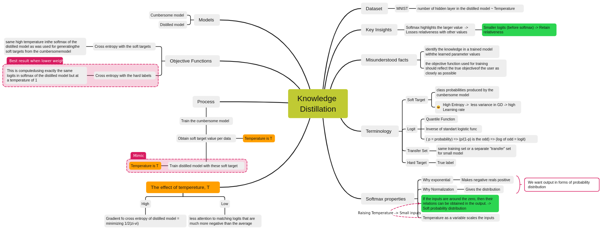

Sources for answering the questions:

1. [https://www.youtube.com/watch?v=k63qGsH1jLo&ab_channel=KapilSachdeva](https://www.youtube.com/watch?v=k63qGsH1jLo&ab_channel=KapilSachdeva)
2. [https://www.youtube.com/watch?v=BWuAeCBvavw&ab_channel=TwinEdProductions](https://www.youtube.com/watch?v=BWuAeCBvavw&ab_channel=TwinEdProductions)
3. [https://arxiv.org/pdf/2110.00329.pdf](https://arxiv.org/pdf/2110.00329.pdf)
4. [https://www.youtube.com/watch?v=yz_A1Vv1F3I&ab_channel=ComputerVisionFoundationVideos](https://www.youtube.com/watch?v=yz_A1Vv1F3I&ab_channel=ComputerVisionFoundationVideos)
5. [https://arxiv.org/abs/2006.12000](https://arxiv.org/abs/2006.12000)

**Take a look at the paper**

## Teacher-student knowledge distillation

The transferred knowledge of the cumbersome/teacher model, which has a higher capacity and requires a massive amount of computation, to distilled/student model, which cannot be fully utilized with the train from scratch with a large dataset. Instead of the student model learning the information in the data directly, called hard target, the teacher model teaches the student the relational information known on the data, called soft target.

## W**hy mimicking a trained large-capacity model would benefit a smaller model?**

The smaller model cannot utilize large datasets. On the other hand, the large model can. It can extract information from very large, highly redundant datasets requiring regularization, such as dropout. The knowledge acquired by the large model also includes the relationship between the data. Learning the relationship between the information obtained by the large model from the vast data provides an advantage in terms of the small model's capacity. Also, the small model has fast inference time due to its small size. It allows us to have a fast inference time by imitating the information of the large model.

## S**oft Targets & Temperature (in the context of TSKD)**

Softmax stresses the larger value; however, it may lose relativeness with other values. For example, the input set {1,2,3} gives approximately {0.09, 0.24, 0.66}. The inputs can be scaled with the temperature value and affect the outputs. To illustrate, for the same input set and T is 5, the output is approximately {0.26, 0.32, 0.40}. It highlights the big one; it does not change. While with the increasing temperature, their relationship became more visible.

The same logic applies to ML. The softmax function is generally used as an output layer activation function since its result carries probability distribution properties. For instance, if the result gives an output with a probability of close to three among ten possible classes, we can deduce the properties of these three classes are similar.

Due to the nature of the Softmax function, it may not be easy to see because of the convergence at the ends (If the values are high). We will apply the temperature hyperparameter to them; we move them to an area where we can see their relationship quickly. In this way, we make the probability distribution between classes smoother.

We apply this concept to the pre-trained teacher model to train the student model. We teach the outputs of the teacher model with a specific temperature value (which is a soft target)  to the student model with the same temperature value.

## Alternative Approach

The following method is the Knowledge Distillation method, which does not employ the Teacher-Student paradigm to transfer knowledge.

“Self-Knowledge Distillation”. It has two branches according to [3]: Data augmentation-based approaches and the auxiliary branch-based self-distillation.