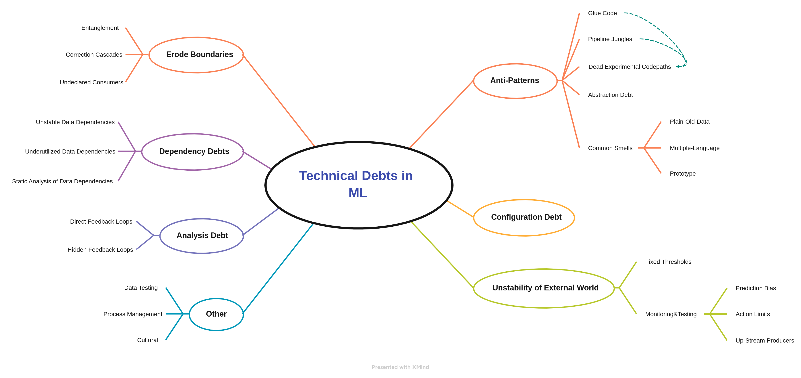

# Importance-of-MLOps

In this section I presents two important review papers' summary: 

- Challenges in Deploying Machine Learning: a Survey of Case Studies by Paleyes, Urma, Lawrence
- Hidden Technical Debt in Machine Learning Systems by Sculley et al.

# Challenges in Deploying Machine Learning: A Survey of Case Studies

Figure 1: Considerations, Issues, and Concerns explored in the study

The study taxonomizes the challenges in the machine learning (ML) deployment stage into
five topics. The first four are technical, and the last one is non-technical: Data Management,
Model Learning/Selection, Model Verification, Model Deployment, and Cross-Cutting
Aspects. Each occupies a place in the deployment phase, and they are processes that can
progress by receiving feedback from each other.

Data management consists of data collection, preprocessing, augmentation, and analysis—
data collection questions the existence of the data, data discovery. Although the
data/dataset exists, it requires preprocessing, such as data dispersion and cleaning. Data
augmentation simply refers to an increasing number of data. However, if the task is not
unsupervised, the labeling problem arises. Other concerns here are access to experts, and
the available data is not rich enough to cover the entire problem. Analyses of the data cover
the studies to improve data quality.

Model learning includes three subtopics: Model training, model selection, and hyper-
parameter selection/hyper-parameter optimization (HPO). Computational cost and
environmental impacts are the main concerns for model training. The model selection has
three issues: If the model is complex, the teams may overwhelm to optimize. If the resource
is restricted, the model should not slow down the iterative process. If the model is not
understandable in business domain terms, it makes the output difficult to interpret. One
issue of HPO is related to resources: Staying away from options that will increase your
hyperparameter set is logical if there are limited resources to try the elements in the set.
HPO often needs to consider specific requirements imposed by the model's environment so
hardware-aware optimization is another issue in this subtopic.

Model verification challenges constitute three aspects: requirement encoding, formal
verification, and test-based verification. Not only reliable performance but also business-
driven performance is added to the requirements. The verification requires high-quality
standards, which are formally set via extensive regulatory frameworks. Tests should consider
the whole real-world environment, which is challenging to be alone. However, simulations
can help in this case but are based on some assumptions.

Model deployment challenges focus on the ineffectiveness of DevOps in the machine
learning process. The study examines it under three headings: Integration, Monitoring, and
Updating. Integration refers to "implementing the model itself in a form that can be
consumed and supported." (Although the table mentions "operational support" under this
section, I could not find any specific paragraph for this.) (I'm cutting this section short
because this part is covered in another paper and the paper is explained with an above-
average word count.)

There are non-technical challenges that ML brings to our life: ethical and security concerns.
Gaining the end user's trust is considered a challenge in this study. Ethical issues are
the following: Restricting access to data due to some regulations that the country restricts,
engineers only thinking technically and not thinking about the social dimension, the labeling
of the trained systems by us, who are prejudiced, a lot of artworks are given for educational
purposes for machine learning to produce art content, the issue of who will own the
property rights of the output, and, last but not least, empowering decision-making on ethical
matters. The upcoming concerns are from security. All of them are adversarial attacks:
intentionally poisoning the data used in training, stealing the model using the input and
model output given to the model, and reconstructing training data from model parameters,
model inversion. The possibility of not using an application that you put on the field with a
lot of effort and not giving confidence to the end-user was also discussed with some
practical solutions. The possible answers include including the end-user in the process, giving
importance to the user's feedback, and explaining the model to the end user. The study
emphasizes that the last proposal should be a model metric: explainability score.

After introducing these challenges, the study classified proposed solutions to these
challenges: Tools & services and Holistic approaches. Although the study's main
contributions are to overlook the challenges in practices in ML, the main goal is to show the
academic world's awareness of these challenges.

# Hidden Technical Debt in Machine Learning Systems

The study makes us think that the things that machine learning brings in have a price. It
covers technical debts under seven topics: the border erosion -a boundary problem brought
by complexity-, dependency, analysis, configuration debts, anti-patterning -problems arising
from not having a specific pattern-, instability of the external world, and others.

Firstly, the study discusses boundary erosion. Encapsulation is not possible for machine
learning. It mixes the signal, so it is entanglement. Changing Anything Changes Everything
(CACE) rule states itself very clearly. Two mitigation strategies are assembling and detection
as they occur. Solving a different and new problem with minor corrections makes it
dependent on the change in the old problem. This kind of chain fix leads to improvement
deadlock. Suggested strategies for correction cascades are proceeding by changing the root
model, not chaining, or solving a new problem by training a completely different model. The
equivalent of visibility debt in machine learning is mentioned under this section as
undeclared consumers. However, they will state their subtitles under analysis debt.

Secondly, the dependencies are discussed. Although dependency can be code and data-
related, data dependency is the key player because of it untangle characteristic. Unstable
data dependencies can happen either implicitly or explicitly. Both are dangerous as an input
signal that looks like an improvement can negatively affect another system using an output
signal. Creating a versioned copy of a given signal is suggested to prevent this. As we delete
the modules that are not necessary for the code, the input signals that do not provide much
benefit should also be removed. This situation is called underutilized data dependency in the
study, and they also taxonomies these features as legacy, bundled, epsilon, and correlated.
For detection of these features, Leave-one-feature-out evolution is advised. Static data
analysis is another aspect for error checking, tracking down consumers, and enforcing
migration and updates. An automated feature management system helps to make the
migration and deletion much safer in practice.

Thirdly, ML has analysis debt because it has feedback in it. It could be direct or hidden. It
can be a direct feedback loop such as active learning. As a strategy, adding randomization or
isolation is implied. It can be hidden since the world has indirect since it is no surprise that
the two systems affect each other indirectly in the world, and there is not any direct strategy
to detect this.

Fourthly, the study debates the anti-patterning of ML. The difficulties of not having a specific
pattern as in traditional methods are mentioned. Using a generic package may prevent us
from taking advantage of the domain-specific features or deviate the objective function from
our domain-oriented purpose, which refers to glue code. Pipeline jungles is a glue code case
and refer to the data preprocessing phase. The study stated that the separate work of
engineers and researchers is the root reason. Also, the study expresses another factor: dead
experiment code paths, which occur as a natural consequence of both. Periodic reexamining
each branch to see what can be removed is a strategy for this problem—all of these highlight
the lack of solid abstractions of ML systems, abstraction debt. There is not any abstraction
like the traditional approach. Lastly, the study mentions some "smells" in ML that could be
indicators. These are plain-old-data type, multiple-language, and prototype smells.

Then, Configuration debt is taken up. It is mentioned that the calibration is ignored at first,
but this leads to a structural error. The study defines six different principles to prevent
calibration debt.

As the ML system's inputs are taken from the external world, the world's instability is
considered a different subtopic. The world consists of dynamic systems however, the model
can have fixed thresholds. Instead of this, adaptive thresholds can be used. Real-time
monitoring and testing of the system are required for long-term reliability. Of course, the
question of what to monitor arises. For this, the study offers three different starting points.
It is emphasized in the article that monitoring and testing are essential to developing this
mechanism to react in real-time.

Finally, the study mentions other debts: Data testing, reproducibility, process management,
and culture. Checking data distribution can be helpful in a robust, well-functioning system,
but it is another debt. Reproducibility, a necessity brought by science, is also a particular
problem: The randomness in machine learning makes it difficult to follow this rule. The cost
of maintaining what we mention so far is another debt, and it has a managerial obligation.
Creating an environment where ML engineers and researchers can work together, and
programming appropriately brings a cultural debt.

The study aims to support the development of the concept of sustainability of ML projects.
Also, it emphasizes that this sustainability can be achieved with the awareness of both ML
engineers and ML researchers.
